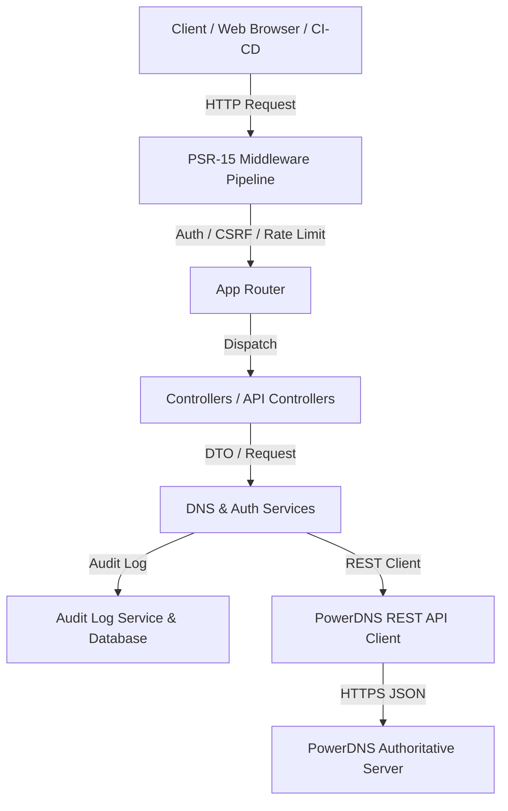

# PHP-PDNSManager Enterprise Edition


## Enterprise DNS Management Web GUI & REST API for PowerDNS Authoritative Server

[](https://github.com/alsyundawy/PHP-PDNSManager/actions)
[](https://packagist.org/packages/php-pdnsmanager/php-pdnsmanager)
[](https://powerdns.com/)
[](LICENSE)
[](https://github.com/alsyundawy/PHP-PDNSManager/stargazers)

---

## 📌 Ringkasan

**PHP-PDNSManager Enterprise Edition** adalah platform **Web GUI modern dan REST API Gateway** yang dirancang khusus untuk mengelola **PowerDNS Authoritative Server**. Dibangun dengan arsitektur PHP 8.1+ berstandar PSR (PSR-7, PSR-11, PSR-14, PSR-15, PSR-18), platform ini menyajikan kecepatan tinggi, keamanan tingkat enterprise, serta skalabilitas maksimal untuk infrastruktur DNS berskala besar.

> [!NOTE]
> Proyek ini menggunakan arsitektur *framework-agnostic modular* dengan penekanan pada zero-lock-in, strict typing, dan pipeline middleware terisolasi.

---

## ✨ Fitur Utama

- 🌐 **Manajemen DNS Zone Komprehensif**
  - Pengelolaan Zone Native, Master, dan Slave dengan pencarian & filter instan.
  - Dukungan serial auto-increment (YYYYMMDDNN) dan penanganan SOA otomatis.
- ⚡ **Pengelolaan DNS Records Super Cepat**
  - Operasi CRUD untuk berbagai jenis record: `A`, `AAAA`, `CNAME`, `MX`, `TXT`, `NS`, `SRV`, `CAA`, `PTR`, dan `NAPTR`.
  - Inpresi validasi FQDN dan rdata secara real-time.
- 🔐 **Keamanan & DNSSEC Automation**
  - Manajemen Cryptokeys (KSK / ZSK) dan publikasi Record DS secara otomatis.
  - Hashing kata sandi berbasis `Sodium` (Argon2id/Ed25519) dan Autentikasi JWT / Session.
  - **CSRF Protection Engine**, **Rate Limiting Middleware**, dan **Strict CSP Headers**.
- 🛡️ **Audit Logging & Role-Based Access Control (RBAC)**
  - Pencatatan lengkap (*audit trail*) untuk setiap aktivitas perubahan DNS dan akses sistem.
  - Penetapan hak akses terbutir (*fine-grained permissions*) untuk Administrator, Operator, dan Viewer.
- 🔌 **RESTful API V1 Gateway**
  - API V1 berstandar OpenAPI 3.0 / JSON-Schema untuk integrasi otomatisasi (CI/CD, Terraform, Ansible).

---

## 🏗️ Arsitektur Sistem

PHP-PDNSManager memisahkan antara Web/API Presentation Layer, Service Logic, dan PowerDNS REST API Backend:



---

## 🚀 Panduan Instalasi Cepat

### Prasyarat System

- **PHP**: `>= 8.1` (Membutuhkan ekstensi: `pdo`, `json`, `sodium`, `curl`, `mbstring`)
- **Web Server**: Nginx atau Apache (dengan `mod_rewrite`)
- **Database**: MySQL 8.0+ / MariaDB 10.5+ / PostgreSQL 13+
- **PowerDNS Authoritative Server**: `>= 4.x` (dengan REST API aktif)
- **Composer**: `>= 2.2`

### Langkah Setup

```bash
# 1. Clone repositori
git clone https://github.com/alsyundawy/PHP-PDNSManager.git
cd PHP-PDNSManager

# 2. Install dependensi PHP & Node.js
composer install --no-dev --optimize-autoloader
npm install && npm run production

# 3. Salin konfigurasi environment
cp .env.example .env

# 4. Atur kredensial PowerDNS & Database di file .env
# Edit PDNS_API_URL, PDNS_API_KEY, DB_HOST, DB_DATABASE, dll.

# 5. Jalankan migrasi database
php bin/console migrate
```

> [!TIP]
> Untuk panduan instalasi mendalam beserta contoh konfigurasi Nginx dan PowerDNS `pdns.conf`, silakan baca [Panduan Instalasi Lengkap](docs/INSTALL.md).

---

## 📂 Struktur Direktori Proyek

```text
PHP-PDNSManager/
├── app/
│   ├── Console/          # Script CLI & Command Kernel
│   ├── Controllers/      # Web GUI & REST API Controllers
│   ├── Core/             # Middleware Pipeline, Exceptions, & Helpers
│   ├── DTO/              # Data Transfer Objects
│   ├── Events/           # Event Dispatcher & Listeners
│   ├── Middleware/       # Middleware Keamanan (Auth, CSRF, CSP, Rate Limit)
│   ├── Models/           # Model Database & Entities
│   ├── Repositories/     # Abstraksi Database Access
│   └── Services/         # Logika Bisnis & Client PowerDNS REST API
├── config/               # Berkas Konfigurasi Aplikasi (.php)
├── database/             # Schema Migrations & Seeders
├── docs/                 # Dokumentasi Teknis Enterprise
├── public/               # Web Document Root (index.php, static assets)
├── resources/            # Views (Blade/HTML) & Source Frontend (Tailwind/JS)
├── routes/               # Deklarasi Rute Web & REST API
└── tests/                # Pengujian PHPUnit (Unit, Feature, API, Integration)
```

---

## 📚 Dokumentasi Lengkap

| Dokumen | Deskripsi |
| :--- | :--- |
| 📖 [Instalasi & Deployment](docs/INSTALL.md) | Panduan langkah demi langkah untuk menginstal dan menjalankan aplikasi. |
| ⚙️ [Konfigurasi System](docs/CONFIGURATION.md) | Referensi lengkap seluruh opsi `.env` dan file konfigurasi. |
| 🏛️ [Arsitektur Sistem](docs/ARCHITECTURE.md) | Penjelasan mendalam mengenai pola arsitektur, aliran data, dan keamanan. |
| 📡 [Dokumentasi REST API](docs/API.md) | Spesifikasi lengkap endpoint API V1 beserta contoh payload request/response. |
| 🛡️ [Kebijakan Keamanan](docs/SECURITY.md) | Penjelasan fitur proteksi, audit trail, dan prosedur pelaporan kerentanan. |
| 📋 [Deployment Checklist](docs/DEPLOYMENT_CHECKLIST.md) | Daftar periksa persiapan lingkungan produksi & hardening server. |
| ⚡ [Review Performa](docs/PERFORMANCE_REVIEW.md) | Hasil evaluasi performa, strategi caching, dan optimasi. |
| 🗺️ [Roadmap Produk](docs/ROADMAP.md) | Rencana pengembangan fitur pada versi stabil mendatang. |
| 🤝 [Panduan Kontribusi](CONTRIBUTING.md) | Pedoman bagi pengembang untuk mengirimkan Pull Request & standar kode. |
| 📝 [Changelog](CHANGELOG.md) | Riwayat pembaruan dan perubahan versi aplikasi. |

---

## 🧪 Pengujian & Kualitas Kode

Proyek ini menerapkan standar kualitas kode yang sangat ketat:

```bash
# Menjalankan seluruh pengujian unit dan integrasi
make test

# Menjalankan Static Analysis (PHPStan level max)
make stan

# Menjalankan Psalm Analysis
make psalm

# Memeriksa standar kode PSR-12
make cs

# Memeriksa format kode secara otomatis
make fix
```

---

## 📄 Lisensi

PHP-PDNSManager Enterprise Edition didistribusikan di bawah lisensi **MIT**. Lihat [LICENSE](LICENSE) untuk informasi lebih lanjut.

Dibuat dengan ❤️ oleh [Alsyundawy](https://github.com/alsyundawy) dan Komunitas Open-Source.
