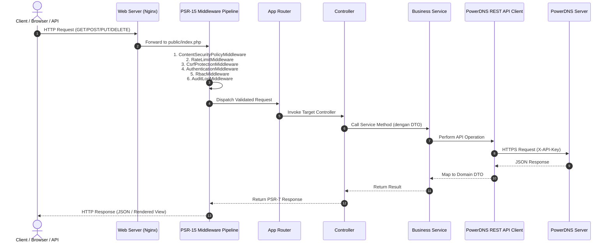

# Dokumen Arsitektur Sistem PHP-PDNSManager Enterprise Edition

Dokumen ini mendeskripsikan arsitektur teknis, pola desain (_design patterns_), struktur komponen, dan alur eksekusi data pada **PHP-PDNSManager Enterprise Edition**.

---

## 📐 Prinsip & Arsitektur Utama

Platform ini dirancang dengan prinsip **Clean Architecture**, **Decoupled System**, dan kepatuhan penuh terhadap standar **PHP-FIG (PSR)**:

- **PSR-7 (HTTP Message Interfaces)**: Mengabstraksi Request dan Response HTTP (`Nyholm\Psr7`).
- **PSR-11 (Container Interface)**: Injeksi Dependensi (_Dependency Injection_) melalui Service Container terpusat.
- **PSR-14 (Event Dispatcher)**: Penanganan event internal secara terisolasi (misal: pemicu penulisan Audit Log saat DNS Zone berubah).
- **PSR-15 (HTTP Server Handlers & Middleware)**: Pemrosesan request HTTP secara bertahap melalui pipeline middleware terisolasi.
- **PSR-18 (HTTP Client)**: Komunikasi HTTP ke PowerDNS REST API melalui `GuzzleHttp\Client`.

---

## 🔄 Alur Pemrosesan Request (Request Execution Flow)

Setiap request HTTP yang masuk ke aplikasi diproses melalui tahapan pipeline yang ketat:



---

## 🧱 Lapisan Komponen (Layered Architecture)

Aplikasi terbagi menjadi 5 lapisan utama yang independen:

```text
+-------------------------------------------------------------------+
|                     Presentation Layer                            |
|    (Web Controllers, API V1 Controllers, Views, JS/CSS Assets)    |
+-------------------------------------------------------------------+
                                 |
                                 v
+-------------------------------------------------------------------+
|                     Application & Middleware                      |
| (PSR-15 Pipeline, Auth Middleware, CSRF, CSP, Rate Limiter, RBAC) |
+-------------------------------------------------------------------+
                                 |
                                 v
+-------------------------------------------------------------------+
|                        Service Layer                              |
| (ZoneService, RecordService, DNSSECService, AuditLogService, DTO) |
+-------------------------------------------------------------------+
                                 |
           +---------------------+---------------------+
           |                                           |
           v                                           v
+------------------------------------+    +-------------------------+
|        PowerDNS REST Client        |    |    Repository Layer     |
| (PowerDNSClient, Guzzle, Resources)|    | (App DB: Users, Audit)  |
+------------------------------------+    +-------------------------+
           |                                           |
           v                                           v
+------------------------------------+    +-------------------------+
| PowerDNS Authoritative Server REST |    |   Application Database  |
+------------------------------------+    +-------------------------+
```

### 1. Presentation Layer (`app/Controllers`)

Bertanggung jawab menerima request, memvalidasi masukan menggunakan `Symfony\Validator`, dan mengembalikan respon berupa tampilan HTML (Web GUI) atau JSON berstandar RFC 7807 (REST API).

### 2. Middleware Layer (`app/Middleware`)

Tersusun sebagai pipeline berurutan (`MiddlewarePipeline`). Setiap middleware bertindak sebagai penjaga batas (_boundary guard_):

- `ContentSecurityPolicyMiddleware`: Menambahkan header proteksi browser.
- `RateLimitMiddleware`: Mencegah banjir permintaan (_rate limiting_).
- `CsrfProtectionMiddleware`: Memvalidasi token CSRF untuk operasi mutasi data.
- `AuthenticationMiddleware`: Memverifikasi token JWT atau Sesi Web.
- `RbacMiddleware`: Memastikan pengguna memiliki peran (_Role_) yang sesuai.
- `AuditLogMiddleware`: Mencatat riwayat panggilan API ke sistem audit.

### 3. Service Layer (`app/Services`)

Tempat bersemayamnya logika bisnis aplikasi. Berkomunikasi dengan PowerDNS REST Client dan Repository lokal. Menggunakan Data Transfer Objects (**DTO**) untuk mentransfer data antar lapisan tanpa mengekspos entitas mentah.

### 4. PowerDNS REST Client (`app/Services/PowerDNS`)

Abstraksi khusus yang menangani serialisasi/deserialisasi komunikasi HTTP dengan PowerDNS Authoritative Server. Dibagi menjadi resource modular:

- `ZoneResource`: Manipulasi Zone (Create, Read, Update, Delete, Notify, Axfr).
- `RecordResource`: Patching RRSets (A, AAAA, CNAME, MX, TXT, dll.).
- `CryptokeyResource`: Operasi DNSSEC (KSK/ZSK, Publishing DS Records).
- `ServerResource`: Monitoring kesehatan server & statistik PowerDNS.

### 5. Repository Layer (`app/Repositories`)

Mengabstraksi akses ke database lokal aplikasi untuk menyimpan akun pengguna, daftar peran (_roles_), token API, dan catatan audit (_audit logs_).

---

## 🔒 Pola Keamanan Data (Security Architecture)

- **Sodium Password Hashing**: Kata sandi pengguna dienkripsi menggunakan pustaka `ext-sodium` (Argon2id/Ed25519) dengan parameter memori dan waktu tingkat tinggi.
- **CSRF Token Engine**: Menggunakan token kriptografi berdurasi terbatas yang ditanamkan pada setiap Form HTML dan divalidasi pada request POST/PUT/DELETE.
- **Strict Typing & Immutable DTO**: Seluruh data yang mengalir antar Service dibungkus dalam objek DTO immutable dengan deklarasi tipe ketat (`declare(strict_types=1);`), mencegah bug kebocoran tipe data (_type juggling_).
