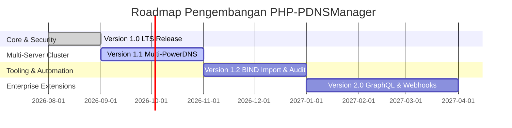

# Peta Jalan Pengembangan (Roadmap) PHP-PDNSManager Enterprise Edition

Dokumen ini mencakup skema peta jalan pengembangan fitur dan milestone utama untuk **PHP-PDNSManager Enterprise Edition**.

---

## 🎯 Milestones & Rencana Rilis

---

## 📌 Rincian Fitur Per Versi

### 🟢 Versi 1.0.0 LTS (Agustus 2026) - _Rilis Stabil Saat Ini_

- [x] Rangkaian Core PHP 8.1+ berbasis standar PSR (PSR-7, PSR-11, PSR-14, PSR-15, PSR-18).
- [x] Manajemen DNS Zone lengkap (Native, Master, Slave) & SOA auto-increment.
- [x] Operasi CRUD untuk seluruh tipe DNS Record standar (`A`, `AAAA`, `CNAME`, `MX`, `TXT`, `NS`, `SRV`, `CAA`, `PTR`).
- [x] Otomatisasi DNSSEC (Manajemen Cryptokeys & Ekstraksi DS Record).
- [x] Fitur Proteksi Keamanan Enterprise (CSRF Engine, Rate Limiting, CSP Headers, Sodium Hashing).
- [x] RESTful API V1 dengan autentikasi JWT / API Key.
- [x] Audit Trail Logging komprehensif untuk seluruh mutasi data.

---

### 🔵 Versi 1.1.0 (Q4 2026) - _Multi-Server Cluster & High Availability_

- [x] **Multi-PowerDNS Server Management**: Kemampuan mengelola multiple kluster PowerDNS Authoritative Server dari satu Web GUI terpusat (`ServerClusterService`, `ServerController`, `ServerApiController`).
- [x] **Health Check Monitoring**: Pengujian otomatis status ketersediaan (_uptime_) server PowerDNS, database, dan resource sistem via Web UI dan JSON API endpoint `/health` (`HealthCheckService`, `HealthController`).
- [x] **Zone Templating**: Pembuatan template DNS record standar untuk mempercepat provisioning zone baru (Template Web Hosting, Template Google Workspace, custom templates) (`ZoneTemplateService`, `ZoneTemplateController`).

---

### 🟡 Versi 1.2.0 (Q1 2027) - _Migration & BIND Tools_

- [x] **BIND Zone File Import/Export**: Fitur pengunggah berkas BIND zone format (`.db`/`.zone`) berbasis RFC 1035 untuk migrasi instan dari server DNS lama serta fitur ekspor format BIND (`BindZoneService`, `ZoneController`).
- [x] **Bulk Record Operations**: Fasilitas pencarian, pengubahan, dan penghapusan record secara serentak (_batch processing_) pada banyak zone sekaligus (`BulkRecordService`, `/zones/bulk-records`).
- [x] **Advanced Audit Log Search**: Pencarian dan filter log audit tingkat lanjut berdasarkan action, user, tanggal, status code, serta fitur ekspor data ke format CSV dan JSON (`AuditLogRepository`, `AuditLogController`).

---

### 🔴 Versi 2.0.0 Enterprise (Q2 2027) - _Next-Gen Integration_

- [x] **GraphQL API Endpoint**: Penyediaan antarmuka GraphQL API (`/graphql`) untuk query zones, zone records, servers, templates, health status, audit logs, serta mutasi zona (`GraphQLController`).
- [x] **Webhook System**: Pengiriman notifikasi real-time terenkripsi tanda tangan HMAC-SHA256 ke webhook eksternal saat terjadi peristiwa mutasi zona/record (`WebhookService`).
- [x] **Multi-Tenant RBAC & Organizations**: Pengelompokan pengguna berdasarkan Organisasi / Tim dengan batasan akses zone spesifik (_Zone-level Permissions_) (`OrganizationService`, schema multi-tenant).
